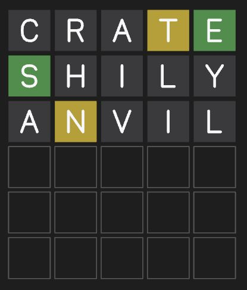

# Swordle

Wordle solver

Use the keyboard to enter words, press enter to calculate possible words and calculate a best next word (printed in console)

# TODO

Definitely a bug in simulate with double letters - to do with the rules not being enforced rigorously enough (ambiguous double letter cases, double counting a word since it abides by multiple rulesets)
Consider:
- Word is TROLL
- simulate BERRY
- TROLL is counted twice, BBYBB, BBBYB
- Need to find a way to invalidate second option in simulation since it is invalid (it can never happen)

Optimize simulation to not have to redo work on non-changing top words

Add keyboard

# Images

